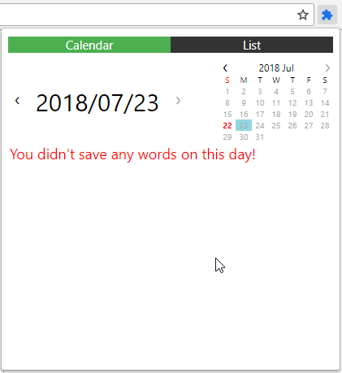
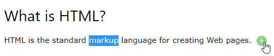
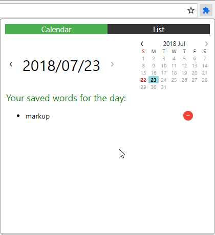
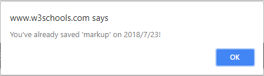
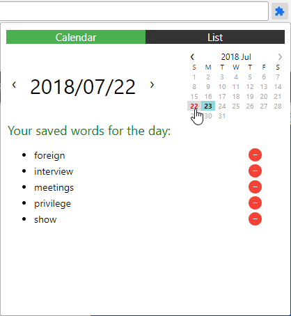
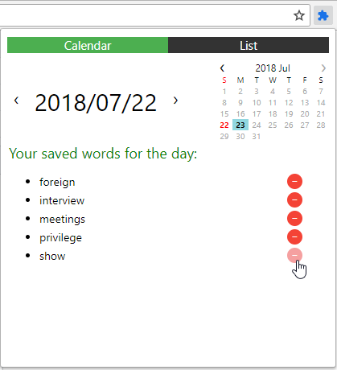
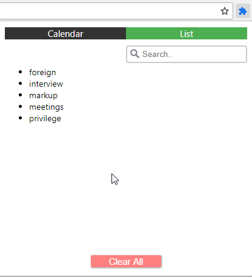
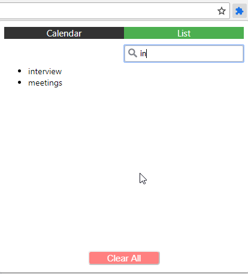

# EasyNote
A chrome extension that allows a user to store a word or phrase when browsing a website.
\
Note: image file is currently not working properly so in the demo it shows a puzzle piece.

---------------------------------------------------------------------------------------------------------------------------------------
### 1. Save a word from a website
#### 1.1 Select a word and click the plus button

#### 1.2 Word Saved

#### 1.3 If you try to save a saved word, a warning will show

---------------------------------------------------------------------------------------------------------------------------------------
### 2. Click a colored day on the calendar to view words saved on that day

---------------------------------------------------------------------------------------------------------------------------------------
### 3. Remove a word

---------------------------------------------------------------------------------------------------------------------------------------
### 4. View all saved words as a list
\

---------------------------------------------------------------------------------------------------------------------------------------
### 5. Search for a word

---------------------------------------------------------------------------------------------------------------------------------------
Icons taken from www.icons-for-free.com
